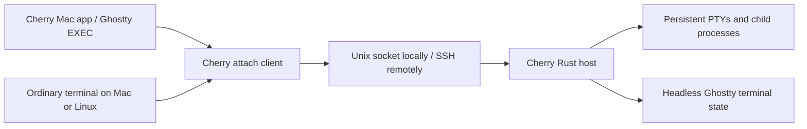

# Portable Cherry Session Host

Status: implemented, and extended by
[multiplexer-default.md](multiplexer-default.md) (protocol 4, holder
processes, events, hosted-by-default local tabs). The architecture below is
the original design reference, not a claim that every proposed feature has
shipped; where it differs from the implementation, the implementation status
and [Host/README.md](../../Host/README.md) describe current behaviour.

## Implementation status

The Rust workspace in `Host/` implements the daemon (`cherry-host serve`), one
holder process per session (`cherry-host hold`, which owns the PTY, the child
and pinned headless Ghostty state from `cherry-vt`, built as ReleaseSafe from a
pinned revision), a framed Unix-socket transport with an SSH stdio gateway, and
the `cherry` start/list/new/attach/kill/remove/shutdown/control CLI. Local
terminal, command and agent tabs in the Mac app run as persistent sessions by
default (see [multiplexer-default.md](multiplexer-default.md)). The app also
exposes every host's sessions through **Persistent Sessions…** with saved SSH
destinations, pinned host identities, disconnect/reconnect, and takeover.
Build, install, service setup, updates, commands, and current bounds are
documented in [Host/README.md](../../Host/README.md).

What exists, relative to the design:

- **Protocol.** Version 4. Every `Hello` is answered with a `Welcome` carrying
  the host's version, and normal operation needs the same version on both
  sides. A client whose host speaks an older version (4 or later) asks it to
  make way (`Replace`) and starts its own, and the sessions carry on; a newer
  host is reported, never replaced. There is no finer capability
  negotiation; fields are additive. Requests carry optional IDs, and a
  subscribed control connection receives session events (added, changed,
  removed, bell, notification, progress, exited, resync). Frames are
  length-prefixed JSON with base64 terminal bytes.
- **Ownership.** Clients trust a socket only in a private directory owned by the
  user, served by a process of the same user; the daemon drops other users'
  connections. Host identity, lock, log, and holder manifests live in a
  durable per-user state directory, so the identity survives daemon restarts,
  reboots, and `/tmp` cleanup.
- **Crash recovery and upgrades.** Sessions live in their holders, which
  survive the daemon: after a crash, a restart or a `Replace`, the holders
  register with the next daemon, which waits briefly for them before listing.
  The holder link between them is versioned, and a daemon speaks every link
  version a live holder may use. Sessions do not survive a reboot.
- **Environment.** The daemon runs with an allowlisted environment and working
  directory `/`. A client may set any session variable (at most 1024, 256 KiB
  in all); `cherry new` passes the terminal's locale and time zone plus
  `--env`, and the Mac app passes a tab's whole environment. Sessions get a
  stable `SSH_AUTH_SOCK` link that `new`, `attach` and `control` repoint at the
  caller's agent while the caller is connected, plus a 2-second grace period;
  over SSH, `list`, `new`, `kill`, `remove` and `shutdown` run `ssh -a`.
  Working directories are absolute, `~`, or `~/…`, resolved on the host.
- **Shared attachment.** Several terminals attach to one session and type
  concurrently (the delivery plan below had deferred multi-writer sessions). The
  minimum requested columns and rows set the shared grid, applied once the
  requested size settles; larger views paint the shared active screen at the
  top left without native scrollback. `attach --takeover` (Attach & Take Over
  in the app) disconnects the others.
- **Liveness and flow control.** Attached and subscribed clients send
  heartbeats and silent ones are evicted, except while the host holds back
  their input. A lagging client's queued output is dropped and replaced by a
  fresh snapshot, followed by the live-only output it missed (titles,
  clipboard writes, notifications), rather than disconnecting it; forwarded
  queries wait for the resync and follow it once. Input backpressure paces
  large pastes, and Detach is ordered after earlier input. Snapshots are
  limited to 8 MiB by dropping the oldest history. `cherry attach`
  reconnects by itself for 30 seconds after a lost connection, never
  resending input.
- **Termination.** Kill escalates from SIGHUP to SIGTERM to SIGKILL across the
  session's processes. A natural exit is a hangup, so `nohup`'d jobs survive.
  Signal deaths report 128 plus the signal, with the signal itself.
- **Queries.** The host answers a fixed set of terminal queries, also while
  detached (and while no daemon runs), and sends the rest to one attached
  client whose terminal answers queries (the one that typed last, or else the
  most recently attached), so a query gets one reply, not one from each
  client. Clients without a terminal (scripted input, redirected output) are
  never asked. With no such client attached, queries get no reply.
- **SSH.** The gateway prints a preamble line, so output from remote shell
  startup files is skipped or reported clearly. It starts a daemon when none
  runs and replaces one of an older protocol, but never one whose identity is
  not the one the client expects (`CHERRY_EXPECTED_HOST_ID`). Management
  commands use batch authentication, and the client never becomes an SSH
  ControlMaster; the Mac app keeps one master connection per destination and
  passes it with `--ssh-control-path`. Kill, remove, and shutdown never start
  or replace a daemon.
- **Service setup.** A systemd user unit (`Restart=on-failure`,
  `KillMode=process`) is provided; while it is enabled, clients start it
  instead of a daemon of their own. No launchd agent is provided for macOS.

Remote project/Git/worktree integration, previews, port forwarding, file
transfer, remote MCP support, and host-reboot recovery remain deferred. The app
keeps one control connection (`cherry control`) per host, and each attached tab
runs its own `cherry attach`, sharing the app's SSH master connection when
there is one. Linux logout policies may require the systemd user service and
lingering. Updating replaces the daemon without ending sessions (see
[Host/README.md](../../Host/README.md#updates)); only a daemon older than
protocol 4 has to be stopped with its own version first.

`Scripts/package-dmg` builds a self-contained Mac test app and disk image with
both helpers, and `Scripts/install-local-app` bundles them too (it needs Rust
unless `CHERRY_SKIP_HOST=1`). Local persistent sessions require no separate CLI
installation.

VT tests cover terminal queries while detached, UTF-8, resizing, snapshots with
exact row positions and styles, and a real Neovim alternate-screen round trip;
host tests reattach Neovim at a new size and cover holders outliving the
daemon. The snapshot has documented limits for graphics, palette/theme state,
cursor shape, OSC 7, an inactive alternate screen, hyperlink ids, and prompt
marks. CI is configured for native macOS arm64 and GNU Linux x86_64/arm64, a
real SSH client-to-Linux test, and the Mac app's hosted and persistent session
tests on macOS 26; its configuration is not a completed CI run. The Ghostty
library targets glibc 2.31, while complete Linux binaries have been exercised
on Debian 12 rather than validated against that minimum.

## User outcome

Run shells, Neovim, and terminal agents on another Mac or Linux machine. Open
Cherry on a laptop, attach to those sessions, disconnect or quit the app, and
later recover the same running processes and terminal state.

Linux support initially means a headless host and command-line client. A Linux
desktop UI is a separate scope. The host machine and session daemon must remain
running; host reboot and daemon crash recovery do not preserve live processes
in the first release.

## Proposed architecture

Build our own Rust session host and attach client, with Ghostty supplying terminal
emulation. Keep the host useful independently of the Cherry Mac app.

Proposed components:

- `cherry-host`: detached daemon, PTY ownership, session registry, terminal state,
  bounded output history, and local control socket. One daemon per user/state
  directory initially. No dependency on the Mac app being open.
- `cherry` CLI: create/list/attach/terminate commands, plus the interactive attach
  adapter used by Ghostty. Closing an attachment never implicitly kills a session.
- Shared Rust protocol/core modules with no agent-provider or project-UI logic.
- Swift client integration that maps host/session identities into Cherry's
  existing sidebar and project model.

Use the same host implementation locally and remotely. Initially introduce it
for opt-in managed sessions; existing local sessions keep their current lifecycle
until explicitly recreated under the host. (Since then local tabs run in the
host by default; see [multiplexer-default.md](multiplexer-default.md).)

## Transport and ownership

- Local clients connect to a user-private Unix socket. Remote clients use system
  SSH to launch a fixed stdio gateway which connects to that socket. The gateway
  is disposable; the daemon outlives SSH. No public listener or relay is needed.
- Preserve normal SSH config, host-key verification, key/agent authentication,
  and jump-host support. Keep binary protocol output separate from diagnostics.
- Frame the protocol with a version, capabilities, message kind, request ID, and
  bounded payload length. Separate terminal byte frames from metadata messages.
- Sessions have host-issued stable IDs; hosts have persisted identities. Project
  identity becomes host ID plus remote path. Never validate remote paths on the
  laptop or fall back to launching locally when the host is unavailable.
- Distinguish session state (starting/running/exited) from attachment state
  (connecting/connected/disconnected). Exiting SSH is not evidence of shell exit.
- Share input and output among attached clients. The minimum requested columns
  and rows determine the canonical terminal size. Size changes publish an
  ordered snapshot to every attachment: the screens only, except a full
  snapshot for a window that leaves viewport rendering; a newer one supersedes
  an older one still queued. A client whose physical size differs renders a
  bounded viewport. Explicit takeover can disconnect other clients.
- Never automatically resend keyboard input after connection loss. A control
  operation with an uncertain outcome must be reconciled by ID/state; retries of
  session creation must not launch duplicate processes.

## Terminal state is the first engineering gate

Use headless `libghostty-vt` behind a small Rust wrapper. It runs on Mac and Linux
without the Swift wrapper, Metal, or a display server. Pin the upstream revision
and build toolchain: upstream currently describes its API signatures as changing.

Each PTY's output is consumed in order by the host's terminal model. Attachment
must capture a snapshot and its output position consistently, then deliver only
the output after that position. A bounded tail of raw output is insufficient to
reconstruct an arbitrary full-screen application.

The first spike must establish:

- What the formatter restores: screen, alternate screen, cursor, colors, input
  modes, scroll regions, tab stops, keyboard modes, and retained scrollback.
- Both active and inactive screen behavior: reconnect inside Neovim, then exit it
  and verify the underlying shell screen. Exercise snapshots taken while UTF-8
  characters or control sequences are split across PTY reads; an output offset
  alone does not preserve a parser's partially consumed sequence.
- How size changes and output are ordered with snapshots, including attachments
  from a laptop with a different terminal size.
- A single authority for terminal query responses. The host must support detached
  workloads without producing duplicate responses when a renderer is attached.
- Which events are live-only (for example clipboard writes and notifications)
  and must not run again during state restoration.
- Explicit limits around images and any state the selected formatter cannot
  reproduce. Do not promise lossless restoration before fixture tests prove it.

Keep live Ghostty surfaces across ordinary tab switches. Snapshot restoration is
for a fresh attachment or recovery, not a new tab-switch replay mechanism. Cherry's
existing `hostManaged` test path is not the implementation template.

Bound scrollback, journals, snapshots, and per-client output queues. Slow clients
must not stall unrelated sessions or cause unlimited memory growth. If a resume
position has expired, create a new consistent snapshot. Persisted metadata/history
is not a promise to resurrect a process after the daemon or machine stops.

## Platform boundary

Target macOS arm64/x86_64 and Linux x86_64/arm64. Start Linux packaging with an
explicit glibc baseline; musl support is a separate build target to validate.

Isolate PTY creation, child reaping, process groups, resize ioctls, signal handling,
and polling behind small platform modules. Evaluate a portable PTY library during
the spike instead of importing Cherry's Darwin-specific process implementation.
Termination must target an owned live process/session, not a persisted PID alone.

The host needs no Xcode, Swift runtime, GPU, or desktop session on Linux. End users
receive binaries; development builds may require Rust and pinned Zig for Ghostty.
Run PTY integration tests natively on both operating systems and exercise packaged
artifacts on each supported architecture. Cross-compilation alone is insufficient.

Deployment must account for logout and service-manager behavior: provide an
appropriate user-service setup on Linux and launchd setup on macOS. Verify the
chosen setup keeps hosted jobs alive after the SSH login session ends. Automatic
service restart does not imply restoration of running PTYs.

## Cherry integration

Preserve native Ghostty EXEC rendering and keyboard encoding by launching the
attach adapter through `GhosttySessionBridge.makeOptions`. The adapter presents
terminal bytes to Ghostty and handles the host protocol/SSH connection separately.

Add explicit disconnect and terminate operations. App quit closes attachments;
terminating a remote session is an intentional host operation. Do not reuse
`TerminalSession.stop()` unchanged for both operations.

Keep the transport/session protocol separate from the existing GUI-owned
`CherryControlServer`. Its process vocabulary is useful, but local workspace
references and peer-PID routing do not form a portable session daemon.

After reliable terminals, move project operations behind host services: reading
`cherry.toml`, working-directory validation, Git/worktrees, process metadata,
service discovery, and agent/MCP control. Remote preview URLs require SSH port
forwarding; file/image paste requires transferring the file before inserting a
remote path. Attention tracking while disconnected belongs on the host.

## Delivery sequence and acceptance

1. **Portable core spike:** build the headless VT wrapper and PTY host on Mac and
   Linux; create/list/attach one shell; restore a running Neovim screen with correct
   input after detach. Define protocol fixtures and terminal query ownership.
2. **Reliable host/CLI:** multiple sessions, stable identities, bounded history,
   consistent snapshots, child exit status, explicit termination, and reconnect.
   Run tests under real PTYs, including output during snapshot/attach and flood
   output with a stalled client. Verify one session cannot starve the others.
3. **SSH and Cherry:** saved hosts, discovery, native attach adapter, disconnected
   state, reconnect, detach/terminate UI, install/version diagnostics, and packaging.
   Compatibility negotiation must fail clearly without disturbing running jobs.
4. **Remote project parity:** host-aware projects, commands/worktrees, agent/MCP
   routing, service forwarding, and host-published attention state.

Acceptance for the first usable version: run an agent and Neovim on both a remote
Mac and Linux host; drop the network, quit Cherry, reconnect at a different grid
size, and recover the same process identities, usable screen, and working input.
Verify closing the attachment leaves jobs alive and explicit termination stops
only the selected session. Run shell/less/Neovim/agent fixtures for arrows,
bracketed paste, alternate screen, colors, Unicode, scrollback, and resize.

Defer hot daemon upgrades, daemon-crash recovery, host-reboot process restoration,
multi-writer sessions, mobile/web clients, a managed relay, and a Linux desktop UI.
Host upgrades must leave an active daemon running or require an explicit session
shutdown; do not silently restart it while it owns jobs. (Multi-writer sessions,
daemon-crash recovery and upgrades that keep sessions have since shipped: sessions
live in holder processes, and a newer client replaces an older daemon; see
[multiplexer-default.md](multiplexer-default.md).)

Budget: several days for the first portability/snapshot proof, then approximately
6–10+ engineering weeks for a dependable custom host and usable Cherry integration.
Remote project parity follows separately. Re-estimate after the first spike; the
largest uncertainty is terminal restoration and query compatibility.

## Evidence and references

- Current Cherry production path: `Sources/Cherry/GhosttySessionBridge.swift`
  (`makeOptions`), `Sources/Cherry/TerminalSession.swift` (native launch and stop),
  and `docs/native-pty.md`. Older lifecycle notes describe a superseded backend.
- [Ghostty library status](https://github.com/ghostty-org/ghostty#cross-platform-libghostty-for-embeddable-terminals)
  and [VT formatter API](https://github.com/ghostty-org/ghostty/blob/main/include/ghostty/vt/formatter.h).
- [Unpeel PTY architecture](https://github.com/unpeel-com/unpeel/blob/443877b6407cdcd275ace55e1bcda82292bb2178/docs/agents/pty-core.md)
  and [attach implementation](https://github.com/unpeel-com/unpeel/blob/443877b6407cdcd275ace55e1bcda82292bb2178/crates/unpeel-attach/src/main.rs)
  were reviewed as references; no implementation has been copied.
