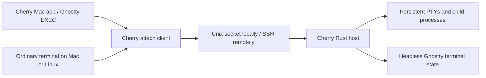

# Portable Cherry Session Host

Status: initial implementation available; the remaining architecture below is
the design reference, not a claim that every proposed feature has shipped.

## Implementation status

The Rust workspace in `Host/` implements the local daemon, persistent PTYs,
pinned headless Ghostty state, framed Unix-socket/SSH transport, and the
`cherry` create/list/attach/kill/remove/shutdown CLI. The Mac app exposes these
through **Persistent Sessions…** with saved SSH destinations and explicit
disconnect/reconnect. Existing native local project terminals are unchanged.
Build, install, service setup, commands, and current bounds are documented in
[Host/README.md](../../Host/README.md).

Multiple terminals can attach to one session and type into it concurrently.
The host uses the minimum requested columns and rows across attached clients;
larger views display the shared active screen at the top left. A larger view's
native terminal scrollback is unavailable while its dimensions differ from the
shared grid. Matching views retain ordinary stream/snapshot history, and the
grid grows again when smaller clients disconnect. The CLI's optional
`attach --takeover` explicitly disconnects other clients; ordinary Mac app
Attach and Reconnect keep them connected.

Workloads survive app exit and SSH disconnection while the daemon remains alive; it
does not recover jobs after a daemon crash or reboot. Linux logout policies
may require the supplied systemd user service and lingering. Upgrades require
finishing running jobs and shutting down the old daemon; there is no hot
upgrade. Shared attachments require protocol version 2: finish existing jobs
and shut down a version 1 daemon with the old client before updating both
helpers. The new client never automatically kills an incompatible daemon.
Remote project/Git/worktree integration, previews, port forwarding,
file transfer, automatic reconnect, and remote MCP support remain deferred.

`Scripts/package-dmg` builds a self-contained Mac test app and disk image with
both helpers. Local persistent sessions require no separate CLI installation.

VT tests cover terminal queries while detached, UTF-8, resizing, snapshots,
and a real Neovim alternate-screen round trip. The snapshot has documented
limits for graphics, palette/theme state, cursor shape, OSC 7, and legacy
alternate-screen/saved-cursor behavior. CI is configured for native macOS
arm64 and GNU Linux x86_64/arm64; its configuration is not a completed CI run.
The Ghostty library targets glibc 2.31, while complete Linux binaries have
been exercised on Debian 12 rather than validated against that minimum.

## User outcome

Run shells, Neovim, and terminal agents on another Mac or Linux machine. Open
Cherry on a laptop, attach to those sessions, disconnect or quit the app, and
later recover the same running processes and terminal state.

Linux support initially means a headless host and command-line client. A Linux
desktop UI is a separate scope. The host machine and session daemon must remain
running; host reboot and daemon crash recovery do not preserve live processes
in the first release.

## Proposed architecture

Build our own Rust session host and attach client, with Ghostty supplying terminal
emulation. Keep the host useful independently of the Cherry Mac app.

Proposed components:

- `cherry-host`: detached daemon, PTY ownership, session registry, terminal state,
  bounded output history, and local control socket. One daemon per user/state
  directory initially. No dependency on the Mac app being open.
- `cherry` CLI: create/list/attach/terminate commands, plus the interactive attach
  adapter used by Ghostty. Closing an attachment never implicitly kills a session.
- Shared Rust protocol/core modules with no agent-provider or project-UI logic.
- Swift client integration that maps host/session identities into Cherry's
  existing sidebar and project model.

Use the same host implementation locally and remotely. Initially introduce it
for opt-in managed sessions; existing local sessions keep their current lifecycle
until explicitly recreated under the host.

## Transport and ownership

- Local clients connect to a user-private Unix socket. Remote clients use system
  SSH to launch a fixed stdio gateway which connects to that socket. The gateway
  is disposable; the daemon outlives SSH. No public listener or relay is needed.
- Preserve normal SSH config, host-key verification, key/agent authentication,
  and jump-host support. Keep binary protocol output separate from diagnostics.
- Frame the protocol with a version, capabilities, message kind, request ID, and
  bounded payload length. Separate terminal byte frames from metadata messages.
- Sessions have host-issued stable IDs; hosts have persisted identities. Project
  identity becomes host ID plus remote path. Never validate remote paths on the
  laptop or fall back to launching locally when the host is unavailable.
- Distinguish session state (starting/running/exited) from attachment state
  (connecting/connected/disconnected). Exiting SSH is not evidence of shell exit.
- Share input and output among attached clients. The minimum requested columns
  and rows determine the canonical terminal size. Size changes publish an
  ordered snapshot to every attachment; a client whose physical size differs
  renders a bounded viewport. Explicit takeover can disconnect other clients.
- Never automatically resend keyboard input after connection loss. A control
  operation with an uncertain outcome must be reconciled by ID/state; retries of
  session creation must not launch duplicate processes.

## Terminal state is the first engineering gate

Use headless `libghostty-vt` behind a small Rust wrapper. It runs on Mac and Linux
without the Swift wrapper, Metal, or a display server. Pin the upstream revision
and build toolchain: upstream currently describes its API signatures as changing.

Each PTY's output is consumed in order by the host's terminal model. Attachment
must capture a snapshot and its output position consistently, then deliver only
the output after that position. A bounded tail of raw output is insufficient to
reconstruct an arbitrary full-screen application.

The first spike must establish:

- What the formatter restores: screen, alternate screen, cursor, colors, input
  modes, scroll regions, tab stops, keyboard modes, and retained scrollback.
- Both active and inactive screen behavior: reconnect inside Neovim, then exit it
  and verify the underlying shell screen. Exercise snapshots taken while UTF-8
  characters or control sequences are split across PTY reads; an output offset
  alone does not preserve a parser's partially consumed sequence.
- How size changes and output are ordered with snapshots, including attachments
  from a laptop with a different terminal size.
- A single authority for terminal query responses. The host must support detached
  workloads without producing duplicate responses when a renderer is attached.
- Which events are live-only (for example clipboard writes and notifications)
  and must not run again during state restoration.
- Explicit limits around images and any state the selected formatter cannot
  reproduce. Do not promise lossless restoration before fixture tests prove it.

Keep live Ghostty surfaces across ordinary tab switches. Snapshot restoration is
for a fresh attachment or recovery, not a new tab-switch replay mechanism. Cherry's
existing `hostManaged` test path is not the implementation template.

Bound scrollback, journals, snapshots, and per-client output queues. Slow clients
must not stall unrelated sessions or cause unlimited memory growth. If a resume
position has expired, create a new consistent snapshot. Persisted metadata/history
is not a promise to resurrect a process after the daemon or machine stops.

## Platform boundary

Target macOS arm64/x86_64 and Linux x86_64/arm64. Start Linux packaging with an
explicit glibc baseline; musl support is a separate build target to validate.

Isolate PTY creation, child reaping, process groups, resize ioctls, signal handling,
and polling behind small platform modules. Evaluate a portable PTY library during
the spike instead of importing Cherry's Darwin-specific process implementation.
Termination must target an owned live process/session, not a persisted PID alone.

The host needs no Xcode, Swift runtime, GPU, or desktop session on Linux. End users
receive binaries; development builds may require Rust and pinned Zig for Ghostty.
Run PTY integration tests natively on both operating systems and exercise packaged
artifacts on each supported architecture. Cross-compilation alone is insufficient.

Deployment must account for logout and service-manager behavior: provide an
appropriate user-service setup on Linux and launchd setup on macOS. Verify the
chosen setup keeps hosted jobs alive after the SSH login session ends. Automatic
service restart does not imply restoration of running PTYs.

## Cherry integration

Preserve native Ghostty EXEC rendering and keyboard encoding by launching the
attach adapter through `GhosttySessionBridge.makeOptions`. The adapter presents
terminal bytes to Ghostty and handles the host protocol/SSH connection separately.

Add explicit disconnect and terminate operations. App quit closes attachments;
terminating a remote session is an intentional host operation. Do not reuse
`TerminalSession.stop()` unchanged for both operations.

Keep the transport/session protocol separate from the existing GUI-owned
`CherryControlServer`. Its process vocabulary is useful, but local workspace
references and peer-PID routing do not form a portable session daemon.

After reliable terminals, move project operations behind host services: reading
`cherry.toml`, working-directory validation, Git/worktrees, process metadata,
service discovery, and agent/MCP control. Remote preview URLs require SSH port
forwarding; file/image paste requires transferring the file before inserting a
remote path. Attention tracking while disconnected belongs on the host.

## Delivery sequence and acceptance

1. **Portable core spike:** build the headless VT wrapper and PTY host on Mac and
   Linux; create/list/attach one shell; restore a running Neovim screen with correct
   input after detach. Define protocol fixtures and terminal query ownership.
2. **Reliable host/CLI:** multiple sessions, stable identities, bounded history,
   consistent snapshots, child exit status, explicit termination, and reconnect.
   Run tests under real PTYs, including output during snapshot/attach and flood
   output with a stalled client. Verify one session cannot starve the others.
3. **SSH and Cherry:** saved hosts, discovery, native attach adapter, disconnected
   state, reconnect, detach/terminate UI, install/version diagnostics, and packaging.
   Compatibility negotiation must fail clearly without disturbing running jobs.
4. **Remote project parity:** host-aware projects, commands/worktrees, agent/MCP
   routing, service forwarding, and host-published attention state.

Acceptance for the first usable version: run an agent and Neovim on both a remote
Mac and Linux host; drop the network, quit Cherry, reconnect at a different grid
size, and recover the same process identities, usable screen, and working input.
Verify closing the attachment leaves jobs alive and explicit termination stops
only the selected session. Run shell/less/Neovim/agent fixtures for arrows,
bracketed paste, alternate screen, colors, Unicode, scrollback, and resize.

Defer hot daemon upgrades, daemon-crash recovery, host-reboot process restoration,
multi-writer sessions, mobile/web clients, a managed relay, and a Linux desktop UI.
Host upgrades must leave an active daemon running or require an explicit session
shutdown; do not silently restart it while it owns jobs.

Budget: several days for the first portability/snapshot proof, then approximately
6–10+ engineering weeks for a dependable custom host and usable Cherry integration.
Remote project parity follows separately. Re-estimate after the first spike; the
largest uncertainty is terminal restoration and query compatibility.

## Evidence and references

- Current Cherry production path: `Sources/Cherry/GhosttySessionBridge.swift`
  (`makeOptions`), `Sources/Cherry/TerminalSession.swift` (native launch and stop),
  and `docs/native-pty.md`. Older lifecycle notes describe a superseded backend.
- [Ghostty library status](https://github.com/ghostty-org/ghostty#cross-platform-libghostty-for-embeddable-terminals)
  and [VT formatter API](https://github.com/ghostty-org/ghostty/blob/main/include/ghostty/vt/formatter.h).
- [Unpeel PTY architecture](https://github.com/unpeel-com/unpeel/blob/443877b6407cdcd275ace55e1bcda82292bb2178/docs/agents/pty-core.md)
  and [attach implementation](https://github.com/unpeel-com/unpeel/blob/443877b6407cdcd275ace55e1bcda82292bb2178/crates/unpeel-attach/src/main.rs)
  were reviewed as references; no implementation has been copied.
